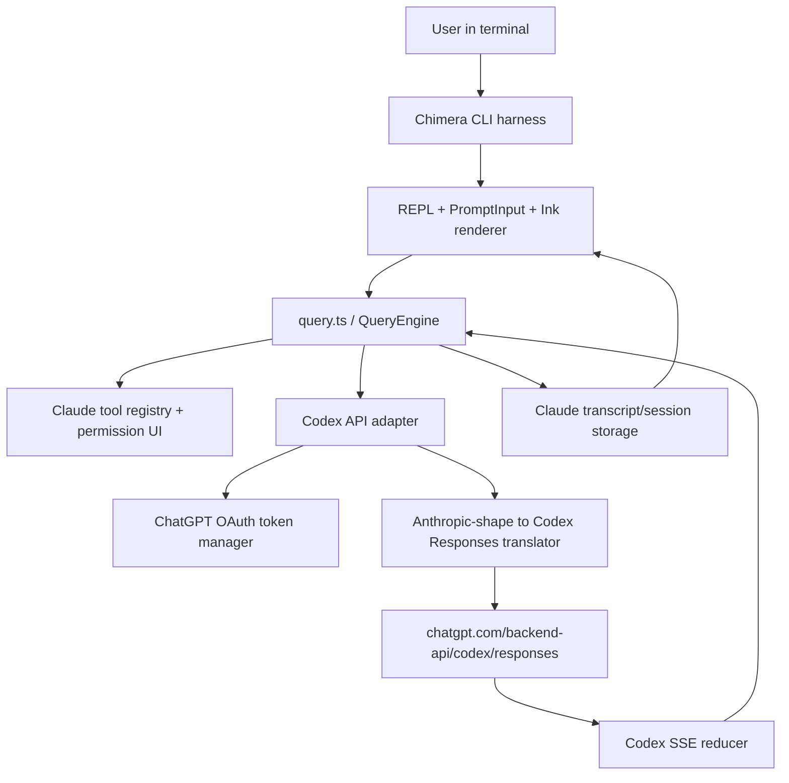

# Chimera Claude Harness Implementation Plan

> **For agentic workers:** REQUIRED SUB-SKILL: Use superpowers:subagent-driven-development (recommended) or superpowers:executing-plans to implement this plan task-by-task. Steps use checkbox (`- [ ]`) syntax for tracking.

**Goal:** Build a `chimera` CLI that preserves as much of the real Chimera CLI, prompt, UI, tool, permission, session, and transcript experience as possible while running fully against ChatGPT/Codex subscription OAuth instead of Anthropic APIs.

**Architecture:** Use the recovered Chimera source tree as the primary product harness. Port the Codex OAuth and Anthropic-to-Codex Responses translation from `claude-code-proxy`, use OpenCode as an MIT-licensed reference for Codex auth/provider ergonomics and open replacements, and hard-disable unrecovered Anthropic-private subsystems until they have honest local or open implementations.

**Tech Stack:** Bun, TypeScript, React/Ink-style terminal UI from Chimera, `@anthropic-ai/sdk` types as the internal message/tool compatibility layer during migration, ChatGPT/Codex OAuth via `auth.openai.com`, Codex Responses endpoint `https://chatgpt.com/backend-api/codex/responses`, translator code from `/Users/arahisman/development/claude-code-proxy`, and reference code from `/Users/arahisman/development/opencode` at commit `668d77bb4e5955eb56a81b3db13ea1dd74400cc2`.

---

## Ground Truth Inputs

### Repositories

- Primary harness: `/Users/arahisman/development/claude-code`
  - Branch: `codex/build-scaffold`
  - Source: `https://github.com/mehmoodosman/claude-code.git`
  - Current build scaffold exists and `bun run build` emits `dist/claude.js`.
- Existing proxy donor: `/Users/arahisman/development/claude-code-proxy`
  - Contains mature Codex OAuth, token refresh, Anthropic request translation, Codex stream reducer, Anthropic SSE output, and count-tokens compatibility.
- OpenCode donor/reference: `/Users/arahisman/development/opencode`
  - Source: `https://github.com/anomalyco/opencode.git`
  - Branch: `dev`
  - Commit: `668d77bb4e5955eb56a81b3db13ea1dd74400cc2`
  - License: MIT.
- Installed Chimera oracle: `/Users/arahisman/node_modules/@anthropic-ai/claude-code`
  - Version: `2.1.81`
  - Provides minified `cli.js`, `resvg.wasm`, `sdk-tools.d.ts`, and vendored `audio-capture`, `tree-sitter-bash`, and `ripgrep` binaries.
  - Use as behavior/native-contract oracle only. Do not copy minified implementation code.

### Product Decision

The product is **Claude-first, OpenCode-as-reference**.

Keep from Chimera:

- CLI entrypoints, slash commands, command UX.
- REPL lifecycle.
- Prompt input, history, queued commands, paste/image handling.
- Custom terminal renderer under `src/ink`.
- Message rendering and structured diff rendering.
- Tool registry, tool implementations, tool prompts, permission dialogs.
- Session transcript and compaction architecture.
- System prompt composition and output styles, rewritten for Codex identity.

Port from `claude-code-proxy`:

- Codex browser PKCE OAuth.
- Codex device/headless OAuth.
- Token store and refresh logic.
- Account ID extraction and `ChatGPT-Account-Id` header.
- Anthropic-shaped request to Codex Responses request translation.
- Codex SSE reducer to Anthropic-compatible streaming events.
- Count-token compatibility for Chimera compaction.
- Model allowlist and reasoning effort mapping.

Use from OpenCode:

- Codex OAuth plugin as a second implementation reference:
  - `/Users/arahisman/development/opencode/packages/opencode/src/plugin/codex.ts`
- Provider/auth abstraction ideas:
  - `/Users/arahisman/development/opencode/packages/opencode/src/provider/provider.ts`
  - `/Users/arahisman/development/opencode/packages/opencode/src/provider/auth.ts`
  - `/Users/arahisman/development/opencode/packages/opencode/src/auth/index.ts`
- OpenAI/Codex provider behavior:
  - OAuth dummy API key removal.
  - URL rewrite to Codex endpoint.
  - `originator`, `User-Agent`, `session_id`, and `ChatGPT-Account-Id` headers.
  - Model filtering for subscription-backed Codex models.
- Later replacement candidates:
  - LSP: `packages/opencode/src/lsp`
  - PTY: `packages/opencode/src/pty`
  - MCP OAuth: `packages/opencode/src/mcp`
  - Agent/session server patterns: `packages/opencode/src/session`, `packages/opencode/src/server`

### Current State Caveat

The current Claude worktree contains build scaffold changes plus a partial native-dependency cleanup from an interrupted turn:

- Modified: `.gitignore`, `README.md`, `src/bootstrap/state.ts`
- Partially modified: `src/components/StructuredDiff/colorDiff.ts`, `src/tools/FileReadTool/imageProcessor.ts`, `src/utils/imagePaste.ts`
- Added/untracked: `package.json`, `bun.lock`, `bunfig.toml`, `scripts/`, `src/build-shims/`, `src/services/oauth/types.ts`, `stubs/`, `docs/`, `tsconfig.json`

Do not discard these changes blindly. First task must separate stable build-scaffold work from experimental native cleanup.

---

## Current Harness Inventory

### High-Value Chimera Modules To Preserve

- CLI:
  - `src/main.tsx`
  - `src/entrypoints/cli.tsx`
  - `src/commands.ts`
  - `src/commands/**`
- REPL and UI:
  - `src/screens/REPL.tsx`
  - `src/components/PromptInput/**`
  - `src/components/messages/**`
  - `src/components/permissions/**`
  - `src/components/StructuredDiff.tsx`
  - `src/components/HighlightedCode.tsx`
- Terminal renderer:
  - `src/ink/**`
- Tool harness:
  - `src/Tool.ts`
  - `src/tools.ts`
  - `src/tools/BashTool/**`
  - `src/tools/FileReadTool/**`
  - `src/tools/FileEditTool/**`
  - `src/tools/FileWriteTool/**`
  - `src/tools/GrepTool/**`
  - `src/tools/GlobTool/**`
  - `src/tools/MCPTool/**`
  - `src/tools/LSPTool/**`
  - `src/tools/TodoWriteTool/**`
  - `src/tools/AgentTool/**`
  - `src/tools/Task*Tool/**`
  - `src/tools/SkillTool/**`
- Prompt system:
  - `src/constants/system.ts`
  - `src/constants/prompts.ts`
  - `src/constants/systemPromptSections.ts`
  - `src/constants/outputStyles.ts`
  - `src/outputStyles/**`
  - `src/skills/**`
- Query/session:
  - `src/query.ts`
  - `src/QueryEngine.ts`
  - `src/utils/sessionStorage.ts`
  - `src/services/compact/**`
  - `src/utils/messages.ts`
- API seam:
  - `src/services/api/claude.ts`
  - `src/services/api/client.ts`
  - `src/services/api/withRetry.ts`
  - `src/services/api/logging.ts`
  - `src/services/api/errors.ts`
- OAuth UI skeleton:
  - `src/components/ConsoleOAuthFlow.tsx`
  - `src/commands/login/**`
  - `src/commands/logout/**`
  - `src/services/oauth/**`

### Missing/Private Subsystems To Disable First

The build currently stubs these classes of recovered modules:

- Ant/private assistant and bridge:
  - `assistant/**`
  - `bridge/peerSessions`
  - `server/**`
  - `ssh/**`
  - `uds*`
- Proactive/remote workflows:
  - `proactive/**`
  - `WorkflowTool/**`
  - `MonitorTool/**`
  - `SubscribePRTool`
  - `PushNotificationTool`
- Advanced compaction/search:
  - `contextCollapse/**`
  - `snipCompact`
  - `snipProjection`
  - `skillSearch/**`
- Internal generated SDK files:
  - `entrypoints/sdk/runtimeTypes.js`
  - `entrypoints/sdk/toolTypes.js`
  - `coreTypes.generated.js`
- Claude API bundled docs:
  - `src/skills/bundled/claudeApiContent.ts` imports missing markdown trees.
- Chrome/computer-use/native private packages:
  - `@ant/claude-for-chrome-mcp`
  - `@ant/computer-use-*`
  - `modifiers-napi`
  - `url-handler-napi`
  - `image-processor-napi`

The first production path must not depend on any of these.

---

## Target Runtime Architecture



Internal message compatibility stays Anthropic-shaped during the first migration because Chimera already uses Anthropic content block types throughout the harness. The Codex adapter becomes the only place that knows about Codex Responses request/stream shapes.

---

## Implementation Tasks

### Task 1: Freeze The Worktree And Separate Stable Scaffold From Experiments

**Files:**

- Modify: `/Users/arahisman/development/claude-code/docs/superpowers/plans/2026-05-01-build-scaffold.md`
- Inspect: `/Users/arahisman/development/claude-code/package.json`
- Inspect: `/Users/arahisman/development/claude-code/src/components/StructuredDiff/colorDiff.ts`
- Inspect: `/Users/arahisman/development/claude-code/src/tools/FileReadTool/imageProcessor.ts`
- Inspect: `/Users/arahisman/development/claude-code/src/utils/imagePaste.ts`

- [x] **Step 1: Capture current status**

Run:

```bash
git status --short
git diff --stat
```

Expected:

```text
M .gitignore
M README.md
M src/bootstrap/state.ts
M src/components/StructuredDiff/colorDiff.ts
M src/tools/FileReadTool/imageProcessor.ts
M src/utils/imagePaste.ts
?? package.json
?? scripts/
?? src/build-shims/
...
```

- [x] **Step 2: Keep stable build scaffold**

Stable build scaffold files are:

```text
package.json
bun.lock
bunfig.toml
tsconfig.json
scripts/audit-deps.mjs
scripts/build.mjs
src/build-shims/bun-bundle.ts
src/build-shims/preload.ts
src/build-shims/modules.d.ts
src/services/oauth/types.ts
stubs/**
.gitignore
README.md
src/bootstrap/state.ts
```

Expected decision: retain these on `codex/build-scaffold`.

- [x] **Step 3: Review interrupted native cleanup**

Review:

```bash
git diff -- src/components/StructuredDiff/colorDiff.ts src/tools/FileReadTool/imageProcessor.ts src/utils/imagePaste.ts
```

Expected decision:

```text
Keep colorDiff.ts switch to native-ts/color-diff.
Keep imageProcessor.ts sharp fallback simplification.
Do not treat imagePaste.ts as final until native replacement policy is written.
```

- [x] **Step 4: Verify scaffold still builds**

Run:

```bash
bun install
bun run build
```

Expected:

```text
Built 2 artifact(s) into dist/
Build used missing recovered-module stubs:
...
```

- [x] **Step 5: Commit stable baseline**

Run:

```bash
git add .gitignore README.md package.json bun.lock bunfig.toml tsconfig.json scripts src/build-shims src/services/oauth/types.ts src/bootstrap/state.ts stubs docs/superpowers/plans
git commit -m "chore: establish claude harness recovery baseline"
```

Expected:

```text
[codex/build-scaffold ...] chore: establish claude harness recovery baseline
```

Do not include `src/utils/imagePaste.ts` in this commit unless Step 3 explicitly marks it stable.

### Task 2: Define A Codex Feature Matrix And Disable Unrecovered Anthropic-Only Paths

**Files:**

- Create: `src/codex/featurePolicy.ts`
- Modify: `src/build-shims/bun-bundle.ts`
- Modify: `src/tools.ts`
- Modify: `src/commands.ts`
- Modify: `src/main.tsx`
- Test: `src/codex/featurePolicy.test.ts`

- [x] **Step 1: Add feature policy**

Create `src/codex/featurePolicy.ts`:

```ts
export type CodexFeature =
  | 'agent'
  | 'bash'
  | 'file-read'
  | 'file-edit'
  | 'file-write'
  | 'glob'
  | 'grep'
  | 'mcp'
  | 'lsp'
  | 'todo'
  | 'skills'
  | 'web-fetch'
  | 'web-search'
  | 'claude-in-chrome'
  | 'computer-use'
  | 'remote-bridge'
  | 'proactive'
  | 'workflow'
  | 'voice-native'
  | 'deeplink-native'

const DEFAULTS: Record<CodexFeature, boolean> = {
  agent: true,
  bash: true,
  'file-read': true,
  'file-edit': true,
  'file-write': true,
  glob: true,
  grep: true,
  mcp: true,
  lsp: true,
  todo: true,
  skills: true,
  'web-fetch': true,
  'web-search': true,
  'claude-in-chrome': false,
  'computer-use': false,
  'remote-bridge': false,
  proactive: false,
  workflow: false,
  'voice-native': false,
  'deeplink-native': false,
}

export function isCodexFeatureEnabled(feature: CodexFeature): boolean {
  const envName = `CHIMERA_FEATURE_${feature.toUpperCase().replace(/-/g, '_')}`
  const override = process.env[envName]
  if (override === '1' || override === 'true') return true
  if (override === '0' || override === 'false') return false
  return DEFAULTS[feature]
}
```

- [x] **Step 2: Make build feature shim deterministic**

Modify `src/build-shims/bun-bundle.ts` so every unrecovered Anthropic-only macro returns false unless explicitly mapped:

```ts
const ENABLED = new Set<string>([
  'TOOL_SEARCH',
])

export function feature(name: string): boolean {
  if (process.env[`CHIMERA_BUNDLE_FEATURE_${name}`] === 'true') return true
  if (process.env[`CHIMERA_BUNDLE_FEATURE_${name}`] === 'false') return false
  return ENABLED.has(name)
}
```

- [x] **Step 3: Gate tools**

Modify `src/tools.ts` so unrecovered tools are excluded by `isCodexFeatureEnabled`.

Required initial state:

```text
enabled: Bash, Read, Edit, Write, Glob, Grep, WebFetch, WebSearch, MCP, LSP, Todo, Agent, Task, Skill, Plan
disabled: REPLTool ant-only wrapper, computer-use, claude-in-chrome, monitor, workflow, web browser panel, terminal capture, proactive, push notification
```

- [x] **Step 4: Gate slash commands**

Modify `src/commands.ts` so missing commands are not registered:

```text
disabled: /assistant, /buddy, /force-snip, /fork, /peers, /proactive, /remote-control-server, /subscribe-pr, /torch, /workflows
enabled: core commands, /login, /logout, /model, /mcp, /memory, /permissions, /review, /resume, /status, /theme, /compact
```

- [x] **Step 5: Test feature policy**

Create `src/codex/featurePolicy.test.ts`:

```ts
import { describe, expect, test } from 'bun:test'
import { isCodexFeatureEnabled } from './featurePolicy'

describe('codex feature policy', () => {
  test('keeps core tools enabled', () => {
    expect(isCodexFeatureEnabled('bash')).toBe(true)
    expect(isCodexFeatureEnabled('file-edit')).toBe(true)
  })

  test('disables unrecovered native/private features', () => {
    expect(isCodexFeatureEnabled('computer-use')).toBe(false)
    expect(isCodexFeatureEnabled('claude-in-chrome')).toBe(false)
    expect(isCodexFeatureEnabled('remote-bridge')).toBe(false)
  })
})
```

Run:

```bash
bun test src/codex/featurePolicy.test.ts
bun run build
```

Expected:

```text
pass
Built 2 artifact(s) into dist/
```

### Task 3: Create The Native Codex Auth Layer

**Files:**

- Create: `src/services/codex/auth/constants.ts`
- Create: `src/services/codex/auth/jwt.ts`
- Create: `src/services/codex/auth/pkce.ts`
- Create: `src/services/codex/auth/device.ts`
- Create: `src/services/codex/auth/token-store.ts`
- Create: `src/services/codex/auth/manager.ts`
- Modify: `src/commands/login/login.tsx`
- Modify: `src/commands/logout/logout.tsx`
- Modify: `src/components/ConsoleOAuthFlow.tsx`
- Tests: `src/services/codex/auth/*.test.ts`

- [x] **Step 1: Port constants**

Create `src/services/codex/auth/constants.ts` using the proxy/OpenCode values:

```ts
export const CODEX_OAUTH_ISSUER = 'https://auth.openai.com'
export const CODEX_CLIENT_ID = 'app_EMoamEEZ73f0CkXaXp7hrann'
export const CODEX_API_ENDPOINT = 'https://chatgpt.com/backend-api/codex/responses'
export const CODEX_OAUTH_PORT = 1455
export const CODEX_ORIGINATOR = 'chimera'
```

- [x] **Step 2: Port JWT account extraction**

Create `src/services/codex/auth/jwt.ts`:

```ts
export interface CodexIdTokenClaims {
  chatgpt_account_id?: string
  organizations?: Array<{ id: string }>
  email?: string
  'https://api.openai.com/auth'?: { chatgpt_account_id?: string }
  'https://api.openai.com/auth.chatgpt_account_id'?: string
}

export function parseJwtClaims(token: string): CodexIdTokenClaims | undefined {
  const parts = token.split('.')
  if (parts.length !== 3) return undefined
  try {
    return JSON.parse(Buffer.from(parts[1]!, 'base64url').toString())
  } catch {
    return undefined
  }
}

export function extractAccountIdFromClaims(claims: CodexIdTokenClaims): string | undefined {
  return (
    claims.chatgpt_account_id ||
    claims['https://api.openai.com/auth']?.chatgpt_account_id ||
    claims['https://api.openai.com/auth.chatgpt_account_id'] ||
    claims.organizations?.[0]?.id
  )
}
```

- [x] **Step 3: Port token store with 0600 permissions**

Create `src/services/codex/auth/token-store.ts`:

```ts
export type CodexTokens = {
  id_token?: string
  access_token: string
  refresh_token: string
  expires_at: number
  account_id?: string
  email?: string
}

export function codexAuthPath(): string {
  const base = process.env.XDG_CONFIG_HOME || `${process.env.HOME}/.config`
  return `${base}/chimera/codex/auth.json`
}
```

Implementation requirement:

```text
read: tolerate missing file
write: mkdir -p parent, chmod file 0600
clear: unlink if exists
redaction: never log raw access_token or refresh_token
```

- [x] **Step 4: Port browser PKCE flow**

Port from:

```text
/Users/arahisman/development/claude-code-proxy/src/providers/codex/auth/pkce.ts
/Users/arahisman/development/opencode/packages/opencode/src/plugin/codex.ts
```

Required browser authorization params:

```text
response_type=code
client_id=app_EMoamEEZ73f0CkXaXp7hrann
scope=openid profile email offline_access
code_challenge_method=S256
id_token_add_organizations=true
codex_cli_simplified_flow=true
originator=chimera
```

- [x] **Step 5: Port device flow**

Port from:

```text
/Users/arahisman/development/claude-code-proxy/src/providers/codex/auth/device.ts
/Users/arahisman/development/opencode/packages/opencode/src/plugin/codex.ts
```

Required endpoints:

```text
POST https://auth.openai.com/api/accounts/deviceauth/usercode
GET/visit https://auth.openai.com/codex/device
POST https://auth.openai.com/api/accounts/deviceauth/token
POST https://auth.openai.com/oauth/token
```

- [x] **Step 6: Integrate login UI**

Modify `src/components/ConsoleOAuthFlow.tsx` to support `provider="codex"` while preserving layout and keyboard behavior.

Required user-facing copy:

```text
Chimera can be used with your ChatGPT Plus/Pro subscription.
Sign in with your ChatGPT account.
Login successful. Press Enter to continue…
```

- [x] **Step 7: Add auth tests**

Create tests:

```text
src/services/codex/auth/jwt.test.ts
src/services/codex/auth/pkce.test.ts
src/services/codex/auth/token-store.test.ts
```

Run:

```bash
bun test src/services/codex/auth
```

Expected:

```text
pass
```

### Task 4: Port The Codex Request/Stream Translator In-Process

**Files:**

- Create: `src/services/codex/translate/types.ts`
- Create: `src/services/codex/translate/model-allowlist.ts`
- Create: `src/services/codex/translate/request.ts`
- Create: `src/services/codex/translate/reducer.ts`
- Create: `src/services/codex/translate/stream.ts`
- Create: `src/services/codex/translate/accumulate.ts`
- Create: `src/services/codex/count-tokens.ts`
- Tests: `src/services/codex/translate/*.test.ts`

- [x] **Step 1: Copy translator contracts from proxy**

Source files:

```text
/Users/arahisman/development/claude-code-proxy/src/providers/codex/translate/request.ts
/Users/arahisman/development/claude-code-proxy/src/providers/codex/translate/reducer.ts
/Users/arahisman/development/claude-code-proxy/src/providers/codex/translate/stream.ts
/Users/arahisman/development/claude-code-proxy/src/providers/codex/translate/accumulate.ts
/Users/arahisman/development/claude-code-proxy/src/providers/codex/count-tokens.ts
```

Keep the Anthropic request shape because Chimera already produces it.

- [x] **Step 2: Preserve model allowlist**

Create `src/services/codex/translate/model-allowlist.ts`:

```ts
export const CODEX_ALLOWED_MODELS = new Set([
  'gpt-5.2',
  'gpt-5.3-codex',
  'gpt-5.4',
  'gpt-5.4-mini',
  'gpt-5.5',
])

export function assertCodexModelAllowed(model: string): void {
  if (!CODEX_ALLOWED_MODELS.has(model)) {
    throw new Error(`Model "${model}" is not supported for ChatGPT subscription Codex`)
  }
}
```

OpenCode reference allows future models matching `gpt-(\d+\.\d+)` greater than `5.4`; keep that as a separate `CHIMERA_EXPERIMENTAL_MODEL_ALLOWLIST=true` behavior, not the default.

- [x] **Step 3: Preserve request mapping**

Required mapping:

```text
Anthropic system blocks -> Codex instructions
Anthropic user text/image/document blocks -> Responses input items
Anthropic assistant text blocks -> assistant message items
Anthropic assistant tool_use blocks -> function_call items
Anthropic user tool_result blocks -> function_call_output items
Anthropic tools[].input_schema -> Responses function tools[].parameters
Anthropic tool_choice -> Responses tool_choice
output_config.effort -> reasoning.effort
sessionId -> prompt_cache_key and x-codex-window-id
```

- [x] **Step 4: Preserve stream mapping**

Required Codex SSE events:

```text
response.output_text.delta -> content_block_delta text_delta
response.output_item.added function_call -> content_block_start tool_use
response.function_call_arguments.delta -> content_block_delta input_json_delta
response.output_item.done function_call -> content_block_stop
response.completed -> message_delta + message_stop
codex.rate_limits.limit_reached -> Anthropic rate_limit_error
```

- [x] **Step 5: Add translator tests from proxy**

Copy and adapt:

```text
/Users/arahisman/development/claude-code-proxy/src/providers/codex/translate/request.test.ts
/Users/arahisman/development/claude-code-proxy/src/providers/codex/translate/model-allowlist.test.ts
```

Add a new stream fixture test:

```ts
import { describe, expect, test } from 'bun:test'
import { reduceCodexEvents } from './reducer'

describe('codex stream reducer', () => {
  test('emits text and tool events in order', () => {
    const events = Array.from(reduceCodexEvents([
      { type: 'response.output_text.delta', delta: 'hello' },
      { type: 'response.output_item.added', item: { type: 'function_call', call_id: 'call_1', name: 'Read' } },
      { type: 'response.function_call_arguments.delta', delta: '{"file_path":"' },
      { type: 'response.function_call_arguments.delta', delta: 'README.md"}' },
      { type: 'response.output_item.done', item: { type: 'function_call', call_id: 'call_1', name: 'Read' } },
      { type: 'response.completed', response: { usage: { input_tokens: 1, output_tokens: 1 } } },
    ] as any))

    expect(events.map((event) => event.kind)).toContain('text-delta')
    expect(events.map((event) => event.kind)).toContain('tool-start')
    expect(events.map((event) => event.kind)).toContain('tool-stop')
  })
})
```

Run:

```bash
bun test src/services/codex/translate
```

Expected:

```text
pass
```

### Task 5: Add The Codex HTTP Client

**Files:**

- Create: `src/services/codex/client.ts`
- Create: `src/services/codex/errors.ts`
- Modify: `src/services/codex/auth/manager.ts`
- Tests: `src/services/codex/client.test.ts`

- [x] **Step 1: Create client**

Create `src/services/codex/client.ts`:

```ts
import { CODEX_API_ENDPOINT, CODEX_ORIGINATOR } from './auth/constants.js'
import { getFreshCodexTokens } from './auth/manager.js'

export async function postCodexResponses(
  body: unknown,
  options: { sessionId?: string; signal?: AbortSignal },
): Promise<Response> {
  const tokens = await getFreshCodexTokens()
  const headers = new Headers({
    authorization: `Bearer ${tokens.access_token}`,
    'content-type': 'application/json',
    accept: 'text/event-stream',
    originator: CODEX_ORIGINATOR,
    'User-Agent': `chimera/${process.env.CHIMERA_VERSION ?? '0.0.0'}`,
  })

  if (tokens.account_id) headers.set('ChatGPT-Account-Id', tokens.account_id)
  if (options.sessionId) {
    headers.set('session_id', options.sessionId)
    headers.set('x-codex-window-id', `${options.sessionId}:0`)
  }

  return fetch(CODEX_API_ENDPOINT, {
    method: 'POST',
    headers,
    body: JSON.stringify(body),
    signal: options.signal,
  })
}
```

- [x] **Step 2: Add error mapping**

Map Codex HTTP errors to Chimera API error classes:

```text
401/403 -> authentication_error
429 -> rate_limit_error
400 -> invalid_request_error
5xx -> api_error with retry eligibility
network timeout -> retryable APIConnectionTimeoutError equivalent
```

- [x] **Step 3: Test headers**

Create a fetch mock test that asserts:

```text
Authorization uses Bearer access token.
ChatGPT-Account-Id is present when account_id exists.
session_id and x-codex-window-id are set.
The URL is CODEX_API_ENDPOINT.
```

Run:

```bash
bun test src/services/codex/client.test.ts
```

Expected:

```text
pass
```

### Task 6: Wire Codex Into Chimera's API Seam

**Files:**

- Modify: `src/services/api/claude.ts`
- Modify: `src/services/api/client.ts`
- Create: `src/services/api/providerMode.ts`
- Modify: `src/utils/model/model.ts`
- Modify: `src/utils/model/providers.ts`
- Tests: `src/services/api/codex-integration.test.ts`

- [x] **Step 1: Add provider mode**

Create `src/services/api/providerMode.ts`:

```ts
export type RuntimeAPIProvider = 'anthropic' | 'codex'

export function getRuntimeAPIProvider(): RuntimeAPIProvider {
  if (process.env.CHIMERA_PROVIDER === 'anthropic') return 'anthropic'
  return 'codex'
}
```

- [x] **Step 2: Route streaming requests**

In `src/services/api/claude.ts`, route inside `queryModelWithStreaming`:

```ts
if (getRuntimeAPIProvider() === 'codex') {
  yield* queryCodexWithStreaming(options)
  return
}
```

`queryCodexWithStreaming` must:

```text
build the same Anthropic request body Chimera already builds
translate it with src/services/codex/translate/request.ts
post it through src/services/codex/client.ts
map the Codex stream back to BetaRawMessageStreamEvent-compatible events
reuse cleanupStream(), updateUsage(), and existing Query loop behavior
```

- [x] **Step 3: Route non-streaming requests**

In `queryModelWithoutStreaming` and `executeNonStreamingRequest`, route Codex through:

```text
translateRequest()
postCodexResponses()
accumulateResponse()
return BetaMessage-compatible object
```

- [x] **Step 4: Route token counting**

Implement Codex count tokens using the proxy's `countTranslatedTokens`.

Required behavior:

```text
Chimera compaction sees input_tokens for the translated Codex request.
The [1m] model suffix convention continues to work.
```

- [x] **Step 5: Preserve retry policy**

Reuse `withRetry.ts` for:

```text
429
529-like transient upstream failures
network reset
SSE timeout
```

Do not retry:

```text
401
403
invalid model
invalid request translation
tool schema validation failures
```

- [x] **Step 6: Add integration tests with mocked Codex**

Test cases:

```text
single text response streams into assistant text
tool call streams into tool_use block
tool result roundtrip continues the turn
429 maps to rate_limit_error
expired token refreshes before request
```

Run:

```bash
bun test src/services/api/codex-integration.test.ts
```

Expected:

```text
pass
```

### Task 7: Rewrite Identity And System Prompt Without Losing Chimera Behavior

**Files:**

- Modify: `src/constants/system.ts`
- Modify: `src/constants/prompts.ts`
- Modify: `src/constants/systemPromptSections.ts`
- Modify: `src/constants/product.ts`
- Modify: `src/constants/outputStyles.ts`
- Test: `src/constants/system.codex.test.ts`

- [x] **Step 1: Rename assistant identity**

Change prefixes:

```ts
const DEFAULT_PREFIX = `You are Chimera, an interactive CLI for ChatGPT Codex.`
const AGENT_SDK_CLAUDE_CODE_PRESET_PREFIX = `You are Chimera, an interactive CLI for ChatGPT Codex, running in SDK-compatible mode.`
const AGENT_SDK_PREFIX = `You are a Chimera agent.`
```

Keep the surrounding Chimera task discipline sections.

- [x] **Step 2: Remove Anthropic-only policy and docs links**

Replace:

```text
Chimera docs URLs
Anthropic billing headers
Claude subscription wording
Claude model launch comments in user-visible strings
```

With:

```text
Chimera local docs wording
ChatGPT subscription wording
model-neutral references
```

- [x] **Step 3: Preserve tool-use behavioral instructions**

Keep:

```text
read before editing
minimal changes
verification before completion
permission prompt behavior
tool result prompt injection warning
hooks treated as user feedback
automatic summarization/context compression
concise CLI communication defaults
```

- [x] **Step 4: Add Codex model environment section**

System prompt environment must include:

```text
You are powered by the model named <model>.
The runtime provider is ChatGPT Codex via subscription OAuth.
Working directory: <cwd>
Platform: <platform>
Today's date: <date>
```

- [x] **Step 5: Test prompt output**

Create `src/constants/system.codex.test.ts` asserting:

```text
prompt contains Chimera identity
prompt does not contain "Anthropic's official CLI"
prompt still contains permission/tool discipline
prompt still contains dynamic boundary marker
```

Run:

```bash
bun test src/constants/system.codex.test.ts
```

Expected:

```text
pass
```

### Task 8: Stabilize The CLI Entrypoint And Product Commands

**Files:**

- Modify: `src/main.tsx`
- Modify: `src/entrypoints/cli.tsx`
- Modify: `src/commands/version.ts`
- Modify: `src/commands/login/login.tsx`
- Modify: `src/commands/model/**`
- Modify: `package.json`
- Test: `src/entrypoints/cli.codex.test.ts`

- [x] **Step 1: Product binary**

Update `package.json`:

```json
{
  "bin": {
    "chimera": "./dist/chimera.js"
  }
}
```

Update build output name in `scripts/build.mjs`:

```text
dist/chimera.js
```

- [x] **Step 2: Version command**

`chimera --version` must print:

```text
0.0.0-local (Chimera)
```

Then wire `CHIMERA_VERSION` from package version.

- [x] **Step 3: Help command**

`chimera --help` must list:

```text
login
logout
model
resume
mcp
permissions
doctor
```

It must not list disabled unrecovered commands.

- [x] **Step 4: Login command**

`chimera login` defaults to browser OAuth.

`chimera login --device` uses device flow.

`chimera logout` clears Codex tokens.

- [x] **Step 5: Model command**

Default model:

```text
gpt-5.4
```

Small/fast model:

```text
gpt-5.4-mini
```

Allowed explicit models:

```text
gpt-5.2
gpt-5.3-codex
gpt-5.4
gpt-5.4-mini
gpt-5.5
```

- [x] **Step 6: Smoke tests**

Run:

```bash
bun run build
bun dist/chimera.js --version
bun dist/chimera.js --help
```

Expected:

```text
0.0.0-local (Chimera)
help text is non-empty
exit code 0
```

### Task 9: Preserve The Claude Tool Loop With Codex Tool Calls

**Files:**

- Modify: `src/query.ts`
- Modify: `src/services/tools/StreamingToolExecutor.ts`
- Modify: `src/services/tools/toolOrchestration.ts`
- Modify: `src/utils/messages.ts`
- Tests: `src/query.codex-tool-loop.test.ts`

- [x] **Step 1: Verify tool_use compatibility**

Expected internal flow:

```text
Codex function_call -> translated Anthropic tool_use block
Claude query loop executes existing Tool
Tool result -> Anthropic tool_result block
Next Codex request -> function_call_output item
```

- [x] **Step 2: Add roundtrip test**

Test script outline:

```ts
import { describe, expect, test } from 'bun:test'

describe('codex tool loop', () => {
  test('executes a Read tool requested by Codex and sends function_call_output next turn', async () => {
    // Mock Codex stream 1: function_call Read {"file_path":"README.md"}
    // Assert Tool executor receives Read input.
    // Mock Codex stream 2: final text after tool result.
    // Assert final assistant message contains text and transcript contains tool_result.
  })
})
```

- [x] **Step 3: Preserve permission prompts**

The existing `canUseTool` path must still run before:

```text
Bash
FileEdit
FileWrite
NotebookEdit
WebFetch
MCP tools
```

The permission dialog must display the original Chimera UI.

- [x] **Step 4: Preserve streaming tool UI**

The UI must still show:

```text
tool use queued
tool use running
tool result collapsed/expanded
file diff previews
bash output summaries
```

Run:

```bash
bun test src/query.codex-tool-loop.test.ts
bun run build
```

Expected:

```text
pass
Built 2 artifact(s) into dist/
```

### Task 10: Replace Or Honestly Degrade Native And Private Dependencies

**Files:**

- Modify: `package.json`
- Modify: `src/native-ts/color-diff/index.ts`
- Modify: `src/components/StructuredDiff/colorDiff.ts`
- Modify: `src/tools/FileReadTool/imageProcessor.ts`
- Modify: `src/utils/imagePaste.ts`
- Modify: `src/services/voice.ts`
- Modify: `src/utils/modifiers.ts`
- Modify: `src/utils/deepLink/protocolHandler.ts`
- Create: `src/services/native/audioCapture.ts`
- Create: `src/services/native/vendorPaths.ts`
- Tests: `src/services/native/*.test.ts`

- [x] **Step 1: Do not install public exact-name native packages**

Keep these out of `package.json`:

```text
audio-capture-napi
audio-capture.node
color-diff-napi
image-processor-napi
modifiers-napi
url-handler-napi
```

Reason:

```text
Some exact-name packages are recent public npm publications with unclear provenance.
The installed Chimera package provides only audio/tree-sitter/ripgrep native binaries.
```

- [x] **Step 2: Use TypeScript color diff**

Keep:

```ts
import {
  ColorDiff,
  ColorFile,
  getSyntaxTheme as nativeGetSyntaxTheme,
  type SyntaxTheme,
} from '../../native-ts/color-diff/index.js'
```

- [x] **Step 3: Use sharp for image resize**

Keep `src/tools/FileReadTool/imageProcessor.ts` using `sharp` directly.

- [x] **Step 4: Clipboard image behavior**

Initial policy:

```text
macOS: osascript fallback
Linux: xclip/wl-paste fallback
Windows: PowerShell fallback
native NSPasteboard: disabled until a vetted local adapter exists
```

- [x] **Step 5: Audio capture adapter**

Use installed Chimera vendor binary only if present:

```text
/Users/arahisman/node_modules/@anthropic-ai/claude-code/vendor/audio-capture/${arch}-${platform}/audio-capture.node
```

Create `src/services/native/audioCapture.ts` with exported contract:

```ts
export type AudioCaptureNative = {
  startRecording(onData: (chunk: Buffer) => void, onEnd: () => void): boolean
  stopRecording(): void
  isRecording(): boolean
  startPlayback?: (sampleRate: number, channels: number) => boolean
  writePlaybackData?: (chunk: Buffer) => void
  stopPlayback?: () => void
  isPlaying?: () => boolean
  microphoneAuthorizationStatus?: () => number
}
```

- [x] **Step 6: Modifier/deeplink behavior**

Initial policy:

```text
modifiers: return false; do not load public modifiers-napi
deeplink URL handler: return null; do not load public url-handler-napi
```

- [x] **Step 7: Tests**

Run:

```bash
bun test src/services/native
bun run build
```

Expected:

```text
pass
build succeeds
```

### Task 11: Use OpenCode As A Reference Library, Not A Base Rewrite

**Files:**

- Create: `docs/opencode-donor-map.md`
- Inspect: `/Users/arahisman/development/opencode/packages/opencode/src/plugin/codex.ts`
- Inspect: `/Users/arahisman/development/opencode/packages/opencode/src/provider/provider.ts`
- Inspect: `/Users/arahisman/development/opencode/packages/opencode/src/provider/auth.ts`
- Inspect: `/Users/arahisman/development/opencode/packages/opencode/src/session/llm.ts`
- Inspect: `/Users/arahisman/development/opencode/packages/opencode/src/session/system.ts`

- [x] **Step 1: Write donor map**

Create `docs/opencode-donor-map.md` with this table:

```markdown
| Area | OpenCode source | Decision |
| --- | --- | --- |
| Codex OAuth | `packages/opencode/src/plugin/codex.ts` | Use as reference; proxy implementation is primary |
| Provider auth schemas | `packages/opencode/src/provider/auth.ts`, `src/auth/index.ts` | Port concepts, not Effect runtime |
| OpenAI provider responses mode | `packages/opencode/src/provider/provider.ts` | Reference for `responses(modelID)` behavior |
| LLM stream abstraction | `packages/opencode/src/session/llm.ts` | Reference only; Claude query loop remains primary |
| System prompt per provider | `packages/opencode/src/session/system.ts` | Reference for Codex prompt, not replacement |
| LSP | `packages/opencode/src/lsp` | Candidate if Claude LSP remains incomplete |
| PTY | `packages/opencode/src/pty` | Candidate if Claude shell PTY breaks |
| MCP OAuth | `packages/opencode/src/mcp` | Candidate for later MCP auth improvement |
```

- [x] **Step 2: License note**

Add:

```text
OpenCode is MIT. Any copied code must retain attribution in repository notices.
Installed Chimera minified bundle is not a source donor.
```

- [x] **Step 3: Use donor map during implementation reviews**

Every implementation PR touching auth/provider/session/tool infrastructure must state:

```text
Claude source used:
Proxy source used:
OpenCode source used:
Installed Claude oracle used:
```

### Task 12: Restore Typechecking In Layers

**Files:**

- Modify: `tsconfig.json`
- Create: `tsconfig.codex-core.json`
- Create: `tsconfig.codex-full.json`
- Create: `docs/typecheck-layers.md`
- Modify: `package.json`
- Tests: Typecheck scripts.

- [x] **Step 1: Split typecheck targets**

Create `tsconfig.codex-core.json`:

```json
{
  "extends": "./tsconfig.json",
  "include": [
    "src/codex/**/*.ts",
    "src/services/codex/**/*.ts",
    "src/services/api/codex-integration.test.ts"
  ]
}
```

Note: the first wider include set pulled the recovered Claude bridge/command
tree through imports and behaved like `check:full`. The core target is kept to
the Codex auth/client/translator/API seam until the recovered tree has real
declarations for its missing private modules.

- [x] **Step 2: Add scripts**

Modify `package.json`:

```json
{
  "scripts": {
    "check:core": "tsc -p tsconfig.codex-core.json --noEmit",
    "check:full": "tsc -p tsconfig.codex-full.json --noEmit",
    "test:codex": "bun test src/services/codex src/codex"
  }
}
```

- [x] **Step 3: Track full typecheck debt**

`check:full` may fail until generated SDK types and missing recovered modules are replaced.

Required report format:

```text
check:core: pass
test:codex: pass
check:full: fail with 2154 diagnostics, top categories:
- generated SDK missing / unrecovered SDK exports: 361 matching diagnostics
- feature-gated private modules and unrecovered source modules: 535 TS2307 diagnostics
- bundler macro globals missing in raw tsc: 146 MACRO diagnostics
- React compiler runtime declaration mismatch: 395 diagnostics
- recovered-source narrowing/unknown debt: 854 diagnostics
```

### Task 13: End-To-End Smoke Harness

**Files:**

- Create: `scripts/smoke-chimera.mjs`
- Create: `tests/fixtures/codex-stream/text.sse`
- Create: `tests/fixtures/codex-stream/tool-call.sse`
- Create: `docs/smoke-chimera.md`
- Modify: `package.json`

- [x] **Step 1: Add mocked Codex server**

Create `scripts/smoke-chimera.mjs`:

```js
import { serve } from 'bun'

const server = serve({
  port: 0,
  fetch(req) {
    const url = new URL(req.url)
    if (url.pathname.includes('/codex/responses')) {
      return new Response(
        [
          'event: response.output_text.delta',
          'data: {"type":"response.output_text.delta","delta":"hello from codex"}',
          '',
          'event: response.completed',
          'data: {"type":"response.completed","response":{"usage":{"input_tokens":1,"output_tokens":3}}}',
          '',
        ].join('\n'),
        { headers: { 'content-type': 'text/event-stream' } },
      )
    }
    return new Response('not found', { status: 404 })
  },
})

console.log(`mock codex server listening on ${server.url}`)
```

- [x] **Step 2: Add smoke script**

Modify `package.json`:

```json
{
  "scripts": {
    "smoke:codex": "bun run build && CHIMERA_PROVIDER=codex bun scripts/smoke-chimera.mjs"
  }
}
```

- [x] **Step 3: Manual smoke**

Run:

```bash
bun run build
bun dist/chimera.js --version
bun dist/chimera.js --help
```

Expected:

```text
version prints
help prints
no missing runtime crash
```

- [x] **Step 4: Live smoke is opt-in**

Live ChatGPT/Codex requests run only when:

```text
CHIMERA_LIVE=1
```

Command:

```bash
CHIMERA_LIVE=1 bun dist/chimera.js
```

Expected:

```text
If authenticated: REPL opens and can answer one simple prompt.
If unauthenticated: login UI appears.
```

### Task 14: Milestone Sequence

**Files:**

- Modify: docs only until each milestone starts.
- Create: `docs/milestones.md`

- [x] **Milestone A: Bootable Harness**

Exit criteria:

```text
bun install passes
bun run build passes
dist/chimera.js --version prints
dist/chimera.js --help prints
disabled features do not appear in help
```

- [x] **Milestone B: ChatGPT Login**

Exit criteria:

```text
chimera login opens browser PKCE flow
chimera login --device prints device code
tokens stored under ~/.config/chimera/codex/auth.json with 0600 mode
chimera logout removes tokens
```

- [x] **Milestone C: One Non-Tool Turn**

Exit criteria:

```text
REPL accepts prompt
Codex request reaches mocked server
streamed text renders in Chimera message UI
transcript persists
```

- [x] **Milestone D: Tool Turn**

Exit criteria:

```text
Codex function_call maps to Claude tool_use
permission prompt appears for protected tool
tool executes
tool_result maps back to Codex function_call_output
assistant completes after tool
```

- [x] **Milestone E: Usable Daily CLI**

Progress:

```text
2026-05-01: Core daily tool matrix covered by bun run smoke:codex-daily-cli.
2026-05-01: Session/slash/error coverage covered by
bun run smoke:codex-session-cli.
Covered: Read, Write, Edit, Glob, Grep, TodoWrite, WebFetch, local stdio MCP,
session JSONL, --resume, headless /compact diagnostics, --model haiku alias,
missing-auth guidance, and streamed rate-limit errors.
Bash is covered by the Milestone D interactive permission smoke. /model is
covered via the CLI --model alias because /model is local-jsx and not
noninteractive. Interactive TTY slash tests are intentionally avoided here:
the existing REPL/tool smokes cover TTY submit and permission flows, while
expect pty CR/newline handling was too brittle for stable slash-command
assertions.
```

Exit criteria:

```text
Read/Edit/Write/Bash/Grep/Glob/WebFetch/MCP/Todo work
/resume works
/compact works
/model works
session storage and first prompt extraction work
error UI handles auth/rate limits
```

- [x] **Milestone F: Maximal Claude Experience**

Progress:

```text
2026-05-01: Output-style and local-skill experience covered by
bun run smoke:codex-experience.
Covered: project .claude/output-styles selection in Codex system prompt,
project .claude/skills listing in Skill-tool reminder, and headless /skill
expansion of SKILL.md body plus arguments.
2026-05-01: Built-in general-purpose, Explore, Plan, and statusline setup
agent prompts rewritten from Claude/Anthropic identity to Chimera identity
and covered by src/tools/AgentTool/builtInAgents.codex.test.ts.
2026-05-01: Parent Agent tool to sync general-purpose subagent round trip
covered by bun run smoke:codex-agent, including child Codex request,
function_call_output handoff, and transcript persistence.
2026-05-01: Plugin-provided stdio LSP server hover round trip covered by
bun run smoke:codex-lsp. Fixed LSPTool availability so ENABLE_LSP_TOOL can
enter the tool pool before async LSP initialization finishes.
2026-05-01: SDK-style stream-json image content block round trip covered by
bun run smoke:codex-image, including sharp-backed normalization to Codex
input_image and transcript persistence.
2026-05-01: Structured diff rendering covered by
src/native-ts/color-diff/colorDiff.codex.test.ts. Fixed highlight.js emitter
compatibility so the TypeScript color-diff fallback renders highlighted hunks,
wrapped lines, full-file views, and the syntax-highlight kill switch.
2026-05-01: Optional native audio capture covered by
src/services/native/nativeAdapters.test.ts. The local Chimera
audio-capture vendor is loaded only when present, public exact-name native
packages remain forbidden, and the voice UX remains disabled by default because
its upstream STT path is Anthropic voice_stream rather than ChatGPT Codex OAuth.
OpenCode donor map is complete in docs/opencode-donor-map.md.
Still open: none for Milestone F. Future voice work needs a ChatGPT-compatible
STT transport before enabling voice mode by default.
```

Exit criteria:

```text
output styles preserved
skills preserved
agent/subagent flows functional
LSP functional
structured diffs functional
image attachments functional through non-native fallback
native audio optional through vetted vendor adapter
OpenCode donor map complete
```

---

## Verification Matrix

Run before claiming any milestone complete:

```bash
bun install
bun run deps:audit
bun run build
bun run check:core
bun run test:codex
bun dist/chimera.js --version
bun dist/chimera.js --help
```

Expected at Milestone A:

```text
install: pass
deps:audit: no unresolved runtime packages except documented type-only issues
build: pass
check:core: pass
test:codex: pass
version/help: pass
```

Expected before final product claim:

```text
check:full: pass or remaining diagnostics are documented disabled-feature modules
live ChatGPT smoke: pass with CHIMERA_LIVE=1
```

---

## Non-Goals For The First Working Product

These are intentionally excluded until the core Codex CLI works:

- Full Claude remote bridge replacement.
- Claude-in-Chrome replacement.
- Computer-use native desktop control.
- Native macOS modifier polling.
- Native macOS URL scheme app bundle.
- Proactive/background scheduled agents.
- Workflow scripts and monitor tools.
- Copying or deminifying installed Chimera bundle internals.

These can return later through honest implementations.

---

## Execution Recommendation

Use subagent-driven implementation by milestone:

```text
Worker 1: Auth and token manager
Worker 2: Codex translator and stream reducer
Worker 3: API seam wiring in claude.ts
Worker 4: CLI/help/login/model product wiring
Worker 5: Native/private dependency degradation and build hygiene
```

Workers must not overlap write scopes. Each worker must run the relevant tests and report exact files changed.
