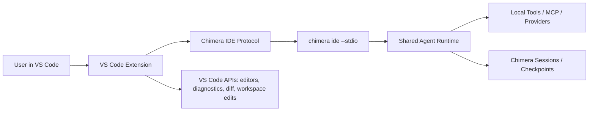

# Chimera VS Code Extension Design

Status date: 2026-05-03

## Goal

Build a first-class VS Code family integration for Chimera that feels like a
native IDE companion, not a terminal skin. The extension should preserve the
power-user CLI workflow while adding IDE-native context, diffs, permissions,
session controls, provider controls, and polished task UI.

The first supported IDE family is VS Code-compatible editors: Visual Studio
Code, Cursor, and Windsurf. JetBrains support is intentionally deferred to a
later plugin that can reuse the same Chimera IDE bridge protocol.

## Non-Goals

- Do not parse terminal escape sequences or scrape the TUI.
- Do not build a cloud session service.
- Do not require a bundled remote server.
- Do not make VS Code the only supported workflow; the standalone terminal CLI
  remains the primary runtime.
- Do not implement JetBrains UI in the first extension project.

## Product Bar

The target experience is Claude-Code-like polish:

- quick launch from command palette and activity/sidebar UI;
- attach a running terminal Chimera session to the IDE;
- send prompts with active file, selection, diagnostics, and workspace context;
- reference files, folders, selections, diagnostics, and git changes naturally;
- preview edits in VS Code native diff views;
- apply edits through VS Code workspace APIs when appropriate;
- show permission prompts in the IDE;
- select models and providers from the IDE;
- login/logout through the same unified provider flow as the CLI;
- browse and resume workspace sessions;
- show task progress, tool calls, checkpoints, and errors in a readable timeline.

## Architecture

The integration has two pieces:

1. `chimera ide --stdio`: a headless Chimera bridge mode that exposes a
   structured JSON-RPC/event protocol over stdin/stdout.
2. `extensions/vscode-chimera`: a VS Code extension that starts or attaches to
   the bridge, collects IDE context, renders UI, and performs IDE-native actions.

The extension must never depend on terminal text output. Human-readable CLI UI
and machine-readable IDE protocol are separate surfaces backed by the same agent
runtime.

## Existing Code To Reuse

- `src/commands/ide/index.ts` and `src/commands/ide/ide.tsx` already provide a
  CLI-facing `/ide` command surface.
- `src/utils/ide.ts` already contains IDE detection, lockfile, workspace, and
  process-discovery logic.
- `src/services/mcp/vscodeSdkMcp.ts` contains legacy VS Code notification
  concepts that should be renamed and made Chimera-native where still useful.
- `src/entrypoints/sdk/*` already defines SDK/control protocol shapes that can
  inform the IDE protocol, but it should not leak placeholder `any` types into
  the extension contract.
- `src/services/providers/*` provides the unified provider/model catalog needed
  by IDE model selection and login flows.

## IDE Bridge Protocol

Transport for phase one is newline-delimited JSON-RPC 2.0 over stdio. A socket
transport can be added later with the same message schema.

### Requests From Extension To CLI

- `initialize`
  - sends protocol version, extension version, workspace folders, editor kind,
    environment hints, and enabled capabilities.
  - receives account status, available commands, available models, current
    provider, permission mode, current session info, and feature capabilities.
- `sendPrompt`
  - sends prompt text and optional context references.
  - starts or continues a Chimera turn.
- `interrupt`
  - interrupts the active turn.
- `setModel`
  - selects a model id, including provider-qualified ids.
- `setPermissionMode`
  - changes ask/accept edits/dontAsk modes using the same semantics as CLI.
- `auth.listProviders`
  - returns unified auth/API-key provider entries.
- `auth.login`
  - starts provider-specific login or API-key configuration.
- `auth.logout`
  - logs out from one provider or all configured providers.
- `session.list`
  - lists workspace sessions.
- `session.resume`
  - resumes a session.
- `session.checkpoint`
  - creates an explicit checkpoint.
- `session.rollback`
  - rolls back to a checkpoint.
- `context.update`
  - updates active editor, selection, diagnostics, visible editors, git state,
    and terminal cwd.
- `mcp.status`
  - returns MCP server status.
- `mcp.reload`
  - reloads MCP and plugin configuration.

### Events From CLI To Extension

- `status`
  - reports idle, thinking, working, editing, installing, committing, pushing,
    done, or error state.
- `assistant.delta`
  - streams assistant text.
- `assistant.message`
  - emits completed assistant message.
- `tool.started`
  - emits tool name, display name, input summary, and tool id.
- `tool.updated`
  - emits progress, stdout/stderr chunks where safe, and intermediate status.
- `tool.completed`
  - emits result summary, structured outputs, and duration.
- `diff.proposed`
  - emits file path, original content, proposed content, and source tool id.
- `edit.applied`
  - emits changed file paths and ranges.
- `permission.request`
  - asks the extension to approve, deny, or persist a tool permission.
- `checkpoint.created`
  - emits checkpoint id, label, files, and timestamp.
- `session.updated`
  - updates session title, model, provider, cost/token usage, and last activity.
- `error`
  - emits structured, user-displayable errors and optional debug detail.

### Protocol Versioning

The protocol starts at `chimera.ide.v1`. Both sides exchange:

- `protocolVersion`;
- `minProtocolVersion`;
- `capabilities`;
- `extensionVersion`;
- `cliVersion`.

If versions are incompatible, the extension shows a clear upgrade action instead
of attempting a degraded partial connection.

## Shared Agent Runtime

The current TUI must be split so that turn execution can run without Ink. The
headless runtime owns:

- conversation/session lifecycle;
- model/provider selection;
- tool execution;
- permission requests;
- MCP/plugin loading;
- context compaction;
- checkpoints;
- structured event emission.

The TUI and IDE bridge become two clients of the same runtime:

- TUI renders events as terminal UI.
- IDE bridge serializes events to JSON-RPC and accepts IDE responses.

## VS Code Extension UX

### Activity Bar And Sidebar

The extension contributes a Chimera activity icon and sidebar with:

- prompt input;
- current model/provider selector;
- permission mode selector;
- login/account state;
- active session title;
- task timeline;
- tool call list;
- checkpoint list;
- quick actions for interrupt, resume, rollback, and open terminal.

The sidebar should be useful but not required. Users can work entirely through
command palette and terminal attach.

### Status Bar

The status bar item shows:

- Chimera state;
- current model or provider/model;
- auth status;
- permission mode.

Clicking it opens a compact quick pick with common actions.

### Command Palette

Commands:

- `Chimera: Open`
- `Chimera: New Task`
- `Chimera: Explain Selection`
- `Chimera: Fix Diagnostics`
- `Chimera: Review Changes`
- `Chimera: Attach Current Terminal`
- `Chimera: Select Model`
- `Chimera: Login`
- `Chimera: Logout`
- `Chimera: Resume Session`
- `Chimera: Create Checkpoint`
- `Chimera: Roll Back To Checkpoint`
- `Chimera: Show MCP Status`
- `Chimera: Reload Plugins`

### Editor Integrations

- Code actions for diagnostics: "Ask Chimera to fix".
- Context menu entries for selection, file, folder, and git changes.
- Optional inline decorations for proposed edits and active tool ranges.
- Native diff editor for proposed file changes.

## Context Model

The extension sends structured context instead of pasting large blobs into user
prompts by default.

Context references:

- `workspace`: workspace folder URI and name;
- `file`: URI, language id, dirty flag, optional selected range;
- `selection`: URI, ranges, selected text hash, selected text when small enough;
- `diagnostics`: URI, ranges, severity, code, source, message;
- `visibleEditors`: ordered active editor list;
- `git`: branch, changed files, staged files, repository root;
- `terminal`: cwd and shell name for attached terminals.

The CLI decides what to read from disk and how much to include in the model
context. This keeps token control and permission policy in Chimera, while the
extension supplies high-quality IDE facts.

## Diff And Edit Flow

There are two edit paths:

1. CLI-owned edits:
   - Chimera tools modify files directly.
   - CLI emits `edit.applied`.
   - Extension refreshes editors and can show changed ranges.
2. IDE-mediated proposed edits:
   - CLI emits `diff.proposed`.
   - Extension opens native diff.
   - User accepts, rejects, or edits manually.
   - Extension applies via `WorkspaceEdit` and responds to CLI.

Phase one should support both because existing tools already edit directly, but
IDE-mediated diffs are the polished path for visible code changes.

## Permission Flow

When a tool requires approval, the CLI emits `permission.request` with:

- tool name;
- display name;
- input summary;
- risk level;
- affected paths;
- suggested allow rules;
- explicit deny reason when present.

The extension renders a modal or notification with actions:

- Allow once;
- Deny;
- Always allow this exact command/path pattern;
- Switch to dontAsk;
- Open permission settings.

`dontAsk` means autonomous execution without prompts, while explicit deny rules
remain authoritative.

## Auth, Providers, And Models

The extension uses the same unified provider flow as CLI:

- ChatGPT/Codex OAuth;
- OpenAI API key;
- OpenRouter, xAI, Google, Perplexity, and other configured provider API keys;
- provider-specific subscription-style auth where supported by the provider
  catalog.

Model selection must show:

- connected providers first;
- provider-qualified model ids;
- current context window and capability badges where known;
- search/filter;
- disabled unavailable models with a login/configure action.

The extension must not reimplement provider auth. It asks the CLI bridge to run
provider auth operations and only renders prompts/input fields.

## Sessions And Checkpoints

Sessions are scoped to workspace roots. The extension shows:

- recent sessions;
- active session;
- model/provider used;
- last activity;
- checkpoint list;
- files changed since checkpoint.

Rollback is implemented by Chimera session/checkpoint logic, with the extension
previewing impacted files before confirming destructive rollback.

## Terminal Attach

The extension supports both directions:

- launched from VS Code: extension starts `chimera ide --stdio`;
- launched from terminal: `/ide` discovers the running extension and attaches.

Attach uses a lockfile or local socket advertised by the extension. It must
validate workspace root and a short-lived auth token before accepting a
connection.

## Security

- The bridge accepts connections only from the local machine.
- Stdio mode is preferred for extension-launched sessions because it avoids a
  listening port.
- Socket attach uses random tokens stored in Chimera config/runtime directories
  with user-only permissions.
- The extension never receives raw provider secrets unless the user types an API
  key into an extension-owned input for forwarding to the CLI.
- Auth files remain owned by Chimera config paths.
- Permission decisions remain enforced by the CLI runtime.
- Workspace trust is checked before enabling autonomous modes or applying edits.

## Packaging

The extension lives under `extensions/vscode-chimera`.

It ships as:

- a VSIX package for manual installation;
- later, Marketplace/OpenVSX package if desired.

The npm package `chimera-code` remains the CLI distribution. The extension
either finds an installed `chimera` binary or offers install/update guidance.

The extension should not bundle the full CLI in phase one. Bundling can be
revisited after package size, update flow, and licensing are settled.

## Testing

CLI-side:

- protocol schema tests;
- bridge initialize/sendPrompt/interrupt tests;
- permission request/response tests;
- provider/model selector data tests;
- session/checkpoint event tests;
- no-TUI runtime tests.

Extension-side:

- unit tests for protocol client;
- tests for context collection from mocked VS Code APIs;
- tests for diff rendering command construction;
- tests for permission UI decisions;
- tests for CLI discovery.

Integration:

- launch extension host;
- start `chimera ide --stdio`;
- send a prompt using a fixture workspace;
- verify context update;
- verify diff proposal opens;
- verify permission prompt roundtrip;
- verify interrupt;
- verify resume session.

Manual smoke:

- VS Code on macOS;
- Cursor on macOS;
- Windsurf on macOS if available;
- workspace with git changes;
- workspace with diagnostics;
- first-run without `chimera` installed;
- first-run with logged-out Chimera;
- logged-in ChatGPT/Codex flow;
- external provider API-key flow.

## Phased Delivery

### Phase 1: Protocol And Runtime Split

Create `chimera ide --stdio` with initialization, status events, prompt sending,
interrupt, model selection, permission mode, and simple assistant streaming.

### Phase 2: Extension Skeleton

Create the VS Code extension package with activation, CLI discovery, stdio
client, status bar, command palette, and a minimal sidebar transcript.

### Phase 3: IDE Context

Add active file, selection, diagnostics, visible editors, workspace folders, git
state, and terminal cwd context updates. Add `@file`, `@selection`,
`@diagnostics`, and `@changes` UX.

### Phase 4: Native Diff And Edits

Add proposed diff events, VS Code diff preview, accept/reject/apply flow,
changed-file refresh, and checkpoint-before-edit behavior.

### Phase 5: Permissions

Add native permission prompts, persisted allow rules, deny handling, and
permission-mode synchronization.

### Phase 6: Auth, Providers, MCP, Plugins

Add login/logout, provider API-key prompts, model selector, MCP status, plugin
reload, and provider capability badges.

### Phase 7: Sessions And Polish

Add session browser, resume, checkpoints, rollback preview, task timeline,
notification tuning, keybindings, onboarding, and Cursor/Windsurf validation.

## Success Criteria

- A user can install the extension, launch Chimera, log in, pick a model, and
  run a coding task without opening a separate terminal.
- A user can attach an existing terminal Chimera session to VS Code through
  `/ide`.
- The agent can use active file, selection, diagnostics, and git changes without
  the user manually pasting them.
- File edits can be previewed in native VS Code diff UI.
- Permission prompts roundtrip through VS Code and preserve CLI semantics.
- Sessions can be resumed from the IDE.
- The CLI remains fully usable without VS Code.
- No extension feature depends on parsing TUI output.
